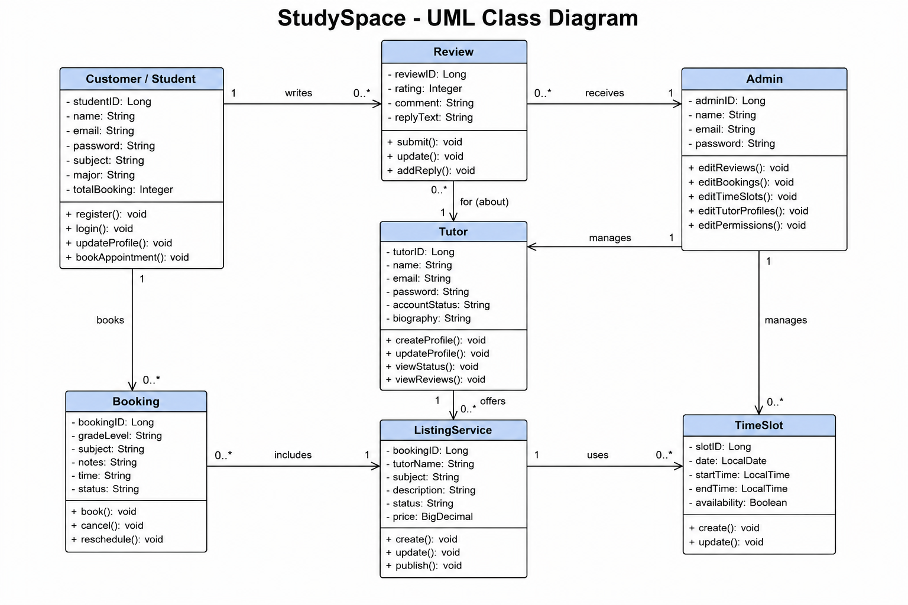

# StudySpace Backend API


## Base URL

Local:
```
http://localhost:8080
```

Production:
```
https://su26-team12.onrender.com
```

---

# Table of Contents

- Overview
- UML Class Diagram
- API Endpoints
  - Customer Endpoints
  - Resource Endpoints
  - Appointment Endpoints
  - Review Endpoints
- Use Case Mapping

---

# 1. Overview

The StudySpace backend exposes a RESTful API for the StudySpace tutoring platform. It allows students to manage their profiles, browse study resources, book tutoring appointments, and submit reviews after completed tutoring sessions.

---

# 2. UML Class Diagram



---

# 3. API Endpoints

---

## 3.1 Customer Endpoints

### Create Customer

**POST**

```
/api/customers
```

Request Body

```json
{
  "name": "Alex Carter",
  "email": "alex@student.edu",
  "password": "password123",
  "accountStatus": "ACTIVE",
  "major": "Computer Science",
  "academicLevel": "Sophomore",
  "preferredStudyTime": "Evening"
}
```

Example Response

```json
{
  "id": 1,
  "name": "Alex Carter",
  "email": "alex@student.edu",
  "password": "password123",
  "accountStatus": "ACTIVE",
  "major": "Computer Science",
  "academicLevel": "Sophomore",
  "preferredStudyTime": "Evening"
}
```

---

### Get All Customers

```
GET /api/customers
```

---

### Get Customer By ID

```
GET /api/customers/{id}
```

---

### Get Customer By Email

```
GET /api/customers/email/{email}
```

---

### Update Customer

```
PUT /api/customers/{id}
```

Example

```json
{
  "name": "Alex Carter",
  "email": "alex@student.edu",
  "password": "password123",
  "accountStatus": "ACTIVE",
  "major": "Computer Science",
  "academicLevel": "Junior",
  "preferredStudyTime": "Morning"
}
```

---

### Update Customer Profile

```
PUT /api/customers/{id}/profile
```

Example

```json
{
  "name": "Alex Carter",
  "email": "alex@student.edu",
  "major": "Computer Science",
  "academicLevel": "Junior",
  "preferredStudyTime": "Evening"
}
```

---

### Delete Customer

```
DELETE /api/customers/{id}
```

---

# 3.2 Resource Endpoints

### Create Resource

```
POST /api/resources
```

Example

```json
{
  "title": "Biology 101 Study Guide",
  "subject": "Biology",
  "description": "Review important vocabulary, diagrams, and chapter summaries.",
  "category": "Science",
  "resourceType": "Study Guide"
}
```

---

### Get All Resources

```
GET /api/resources
```

---

### Get Resource By ID

```
GET /api/resources/{id}
```

---

### Update Resource

```
PUT /api/resources/{id}
```

---

### Delete Resource

```
DELETE /api/resources/{id}
```

---

# 3.3 Appointment Endpoints

### Create Appointment

```
POST /api/appointments
```

Example

```json
{
  "customerId": 1,
  "course": "Biology 101",
  "tutorName": "Emily Wilson",
  "appointmentDate": "2026-07-09",
  "appointmentTime": "2:00 PM",
  "status": "Confirmed",
  "notes": "Need help with chapter review."
}
```

---

### Get All Appointments

```
GET /api/appointments
```

---

### Get Appointment By ID

```
GET /api/appointments/{id}
```

---

### Update Appointment

```
PUT /api/appointments/{id}
```

---

### Delete Appointment

```
DELETE /api/appointments/{id}
```

---

# 3.4 Review Endpoints

### Create Review

```
POST /api/reviews
```

Example

```json
{
  "customerId": 1,
  "appointmentId": 1,
  "tutorName": "Emily Wilson",
  "rating": 5,
  "comment": "Excellent tutoring session!"
}
```

---

### Get All Reviews

```
GET /api/reviews
```

---

### Get Review By ID

```
GET /api/reviews/{id}
```

---

### Update Review

```
PUT /api/reviews/{id}
```

---

### Delete Review

```
DELETE /api/reviews/{id}
```

---

# 4. Use Case Mapping

## Customer Use Cases

| User Story | Related Endpoints |
|------------|------------------|
| Register and manage profile | POST /api/customers, GET /api/customers/{id}, PUT /api/customers/{id}, PUT /api/customers/{id}/profile, DELETE /api/customers/{id} |
| Browse study resources | GET /api/resources |
| View study resource details | GET /api/resources/{id} |
| Book tutoring appointments | POST /api/appointments |
| Manage appointments | GET /api/appointments, PUT /api/appointments/{id}, DELETE /api/appointments/{id} |
| Write tutor reviews | POST /api/reviews |
| Edit/Delete reviews | PUT /api/reviews/{id}, DELETE /api/reviews/{id} |

---

## Provider Endpoints

(To be completed by Eman.)

---

## Administrator Endpoints

(To be completed by Shafat.)
